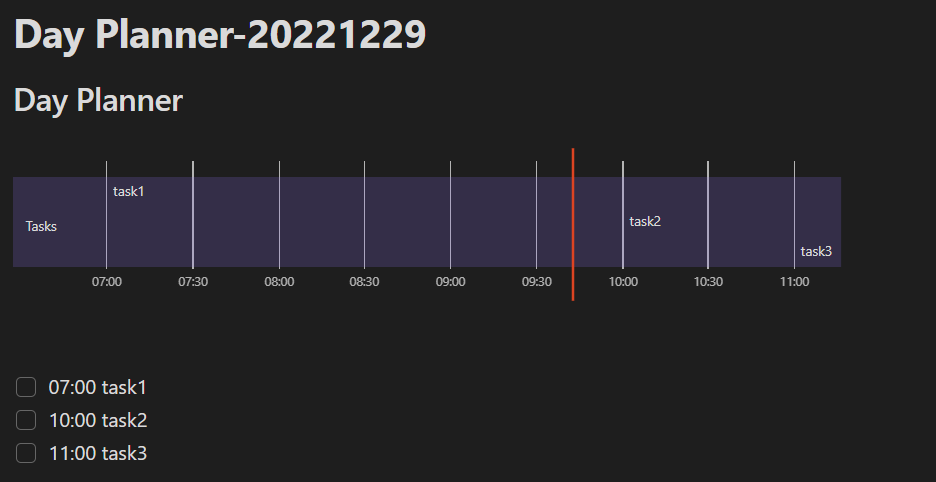
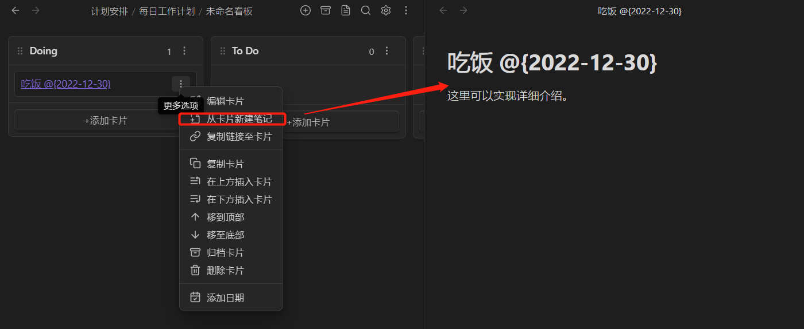

`author: JamesHanZhang`

# Why - 为什么使用Obsidian

**原因**：

* 以markdown为基础，具备可迁移性，反例（Evernote, Onenote,Notion)；
* 以Windows文件夹的方式进行本地存储，完美兼容Typora，反例（Joplin加密乱码保存，多了一道工序）;
* 支持云共享，支持手机端查看和简单编写；
* 插件市场：多插件，更简便，用户数量更多，社区更活跃，插件更新更快；
* 在掌握Markdown的前提下，学习门槛低，这点适用于所有Markdown编辑器；
* 本身能实现所见即所得，页面观看更舒适（当然，不足之处可以通过typora补全）；
* 一站式all in one，集成所有功能，但要警惕，不要因此被捆绑，很多子功能有更好用的软件，比如Xmind，Typora等；
* 完全离线，打开脱离云端，无需加载；

# What - 什么是Obsidian[^1]
Obsidian，以markdown为基础的笔记软件，与它同类型的软件也有很多，比如完全开源的Joplin，同样也是神作，值得推荐。二者不相伯仲，只看个人需求。

Obsidian的主要功能根据用途可以分为：

| 日记随笔     | 工作记录     | 读书笔记     | 阅读清单     |
| ------------ | ------------ | ------------ | ------------ |
| **视频笔记** | **数据复盘** | **任务管理** | **编年史迹** |

# How - 基本操作

## 云同步 - Android

通过云盘直接同步文件夹。本地下载FolderSync APP，可以在[apkpure](https://apkpure.com/cn/)下载。

下载后在Android端安装Obsidian，选择`Open folder as vault`即可同步该文件夹。

凡是支持FolderSync，或者可以双向同步的，都可以采用此类方法。实际上是一种绕路。


## 基本文档操作

### 设置附件保存（图片）

设置 -> 文件与链接 -> 附件默认存放路径，有选择：`[根目录，当前文件夹，指定目录]`

### 文档并排显示

`Ctrl+鼠标左键`可以使得文档并排显示。可以通过拖拽实现双屏切屏。

### 标签

通过`#`井号获得标签。

```
#标签1 #标签2
```


## 双链接用法

通过双方括号double square brackets实现双向链接`[[keyWord]]`。`ctrl+左键`点击可直接通过该关键字创建以此为标题的文档。在该文档中选择：`更多选项->在页面中显示反向链接`即可看到包含该关键词（同样以double square brackets包裹的）的文章。
案例：
[[双向链接的方法]]


### 选定文档

按住`ctrl`，鼠标悬停在双链接上，即可展现该文档。同时`ctrl+左键单击`可进入或创建同名文档。

### 关系图谱

通过关系图谱，来获得所有文档之间的关系。通过设置，可以筛选掉孤立的文档。

## 插入视频
***只能插入在线视频，本地视频因没有播放器，无法插入***
```html
<iframe width="100%" height=500 src="https://v.qq.com/x/page/m3255zxanhz.html" allowfullscreen></iframe>
```


# How - 快速入门 Obsidian[^1][^2]

## 用法1 - 日记随笔【含基本任务】

通过模板及任务搭建，获得日记的功能。快捷键：自定义，例如设置`Ctrl+Alt+1`


### Task插件（自定义快捷键`ctrl + alt + 2`）

```
/*使用方法*/
- [ ] task1
- [X] task2
```
- [ ] task1
- [x] task2


## 用法2 - 任务管理

### Day Planner 插件

第三方插件 -> Day Planner

**Day Planner 则只能扫描特定的文件夹**，但换来了更加精细、更加有趣的日程/任务管理方式。

```
## 标题
- [ ] 07:00 task1 //必须为24小时制
```

可以实现（每次调用可以通过`ctrl+p`打开控制面板，搜索`show`获得show the day planner timeline）

* 甘特图
* 时间线
* 到时间的任务提醒



**文档模式File Mode**：自动创建Day Planner文件夹，每天更新一个日程文件。

**命令模式 Command Line**：将 File mode 切换到 Command mode，**能够让你在任意一页文档中使用 Day Planner 插件**，而无需创建额外的 Day Planner 文件夹。但需要执行`ctrl+p`，搜`link`，点选`Link todays' Day Planner to the current note`.

### Kanban插件

可以像管理代码需求一样，管理自己的工作任务。存储的也是md格式，所以不用担心迁移问题，最多就是调用不出来看板，但依然是能看得懂的。

建立方式：

* 右键点击任意一个文件夹， 选择 `新看板`
* Ctrl+P 唤出命令面板，搜索 `Kanban` ，并选择 `创建新看板`

使用方式：

* 为看板添加时间，则可以在日记反向链接面板看到；
* 每张卡片都可以创建一个文档，文档创建后可以自由转移，一样可以通过双链跳转；



## 用法3 - 工作记录 & 报告复盘

通过Templater插件创建自动化模板，使用DataView插件来让Obsidian有高级检索能力。

### Templater插件


***插件配置***

1. 你需要先建立一个专门用来存放模板的模板文件夹，并且提前写好你所需要的模板

2. 打开【设置 - 插件选项 - Templater】

   - 在 `Template folder location` 将路径指向模板文件夹

   - 打开 `Trigger Templater on new file creation` 这个选项

   - 然后在 `Add New` 那一栏，将文件夹与模板一一对应。左边是文件夹，右边是模板文件。


3. 如此一来，当我们在 `会议记录` 文件夹新建文档，它创建的就不是空白文档，而是加载了模板的文档了。

### QuickAdd 插件

非常强大的插件，但这里只介绍其Template使用方法。两个使用方式：

* 设置Template模板创建快捷键，无需右键文件夹创建文档；
* 让Templater创建文档时，文档以特定格式生成标题，即所需要的日期；

配置方法：

1. 为 `创建日报` 添加一个 QuickAdd 动作；
2. 先点击小闪电，这样才能在命令面板（Ctrl+P）中直接搜索到；再点击小齿轮， 进入详细配置界面；

## 用法4 - 读书批注

### Annotator 插件

Obsidian 原生支持 PDF 阅读，你只需要将 PDF 文件**拖到文件夹上**即可载入，而安装 `Annotator 插件` 除了能让 Obsidian **额外支持阅读 EPUB 格式**的文件，还能进行高亮、批注等操作。

***插件用法***

1. 将你的 PDF 文件拖入 Obsidian 的文件夹上
2. 新建一个文档，然后在文档的最开头添加下面这样的 YAML 语法

```YAML
---
annotation-target: 路径/文件名.pdf
---
```

3. `Ctrl+E` 进入阅读视图，如果无法正确读取 PDF 文档，可以点击右上角的三个小点，然后再点击 `Annotate`。


### Mindmap插件

思维导图插件，自动将文章的各级标题转为思维导图的各个节点。


## 用法5 - 动态表格

### Dataview插件

涉及插件Dataview，将文章自动链接为表格进行管理。假设我们为 4 本书分别写了 4 篇读后感，并在文档的最开头用 YAML 语法进行一点配置（必须设置在文档开头），案例如下：

```YAML
---
日期: 2023-01-05 
锻炼时长: 
锻炼项目: 
饮食: 杂食
睡眠: 6.5h
体重: 92.4kg
BMI: 29.2
---
```

***建立md文档汇总***


```dataview
table 锻炼时长, 锻炼项目, 饮食, 睡眠, 体重, BMI
from "计划安排/2023年/2023年每日数值记录"
sort 日期 desc
```


***代码含义***
	table 定义的是 Dataview 的展现方式
	table 后面接的是你在 YAML 中打的标签；逗号要是英文输入状态；逗号后面接空格
	from "" 引号里的是你所要搜索的文件夹路径
	sort 这段，表示按照阅读时间这一项进行降序排列（descend）
	你也可以把阅读时间换成评分，把 desc 换成 asc，这样一来就是按照评分进行升序

该表格会自动更新，实时扫描笔记库，如发现新增YAML表头包含了过滤标签的文档，会自动在表格内增加一行。


## 用法6 - 视频笔记

### Media Extended & Media Extended Blibli Plugin 插件

视频中弹幕激增的节点，可以用来判断UP主说了哪些话激发观众发送弹幕的热情，能发现运营的道理。B站自带视频笔记功能。


***Obsidian里的操作方法***：

1. 复制粘贴视频网址到 Obsidian 中
2. **在阅读视图下**，才能在 Obsidian 内部打开视频链接
3. **在编辑视图下**，才能通过右上角的五角星截取时间点

## 用法7 - 数据复盘

### Dataview 聚合数据

同动态表格，通过YAML开头来聚合文档。

### Charts插件 - 数据可视化


***使用方法***

安装完插件后，使用 Ctrl+P 唤出命令菜单，然后搜索 charts 关键词，选择 Insert new Chart 即可，然后剩下的就是手动输入数据的基本操作了。

**思考**：大数据excel依然是最佳选择，超大数据的话MySQL,Oracle依然是最佳选择，超级超级大的数据的话，Hadoop, Spark依然是最佳选择。这个数据可视化，就仅限于日常偶尔的计算了。

## 用法8 - 编年史迹

### Timelines插件

可以用插件做投稿，游记时间轴，除了好看好像也没啥大用。

***配置方法*** - 案例（调用需修改）

````YAML
<span 
class='ob-timelines' 
data-date='2021-08-21'
data-title='标题'
data-class='orange'
data-img= '图片链接（在线链接或笔记附件位置都可以）'
data-type='range'
data-end="2000-10-20-00">
    这里填封面简介
</span>

```timeline
影评
```
````


每篇文章需要通过YAML语言打标签：

```YAML
---
tags: [timeline, 影评]
---
```


# References - 参考文献

[^1]: 二一的笔记. [也许是B站最好的Obsidian新手教程！爆肝30天，一站式入门双向链接笔记软件](https://www.bilibili.com/video/BV18a411r7mt/?spm_id_from=333.788&vd_source=29089bddd77076c38a919abaa1c20e09). BliBli.com. 2021.12. 
[^2]: 二一的笔记. [Obsidian8个进阶用法](https://mp.weixin.qq.com/s/MEPva7Os_nOyl1vgTBZTwQ). Wechat. 公众号. 二一的笔记. 2022-04. 

