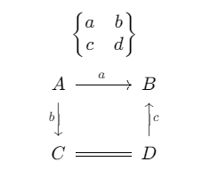

# MARKDOWN 学习指导手册

| 修改日期 | 版本| 修改作者 | 修改内容 |
| :----: | :----: | :---: | :--- |
| 2022.11.10 | 1.0 | 张晟晗 | 摘录网络资料学习Markdown |
| 2022.11.13 | 1.1 | 张晟晗 | 增加视频/公式说明及书写细节 |
| 2022.11.24 | 1.2 | 张晟晗 | 增加目录插入及标签管理 |

-----
**自动生成目录**
<!-- TOC -->

- [MARKDOWN 学习指导手册](#markdown-学习指导手册)
  - [为什么使用markdown](#为什么使用markdown)
  - [平台推荐](#平台推荐)
    - [线下软件推荐](#线下软件推荐)
    - [线上平台推荐](#线上平台推荐)
  - [分隔行](#分隔行)
  - [标题](#标题)
  - [段落样式](#段落样式)
    - [字体](#字体)
    - [分隔线](#分隔线)
    - [下划线和删除线](#下划线和删除线)
    - [脚注](#脚注)
  - [列表](#列表)
  - [区块引用](#区块引用)
  - [代码](#代码)
  - [链接或图片](#链接或图片)
  - [表格](#表格)
  - [HTML标签](#html标签)
  - [转义符号 - 反斜杆 backslash \\ 的意义](#转义符号---反斜杆-backslash--的意义)
  - [公式](#公式)
  - [Catalogue 目录生成与管理](#catalogue-目录生成与管理)
    - [自动生成标签](#自动生成标签)
    - [自动生成目录\[TOC\]](#自动生成目录[TOC])
    - [vscode 自动生成目录](#vscode-自动生成目录)
    - [手写目录](#手写目录)
  - [CSS](#css)
  - [参考文献](#参考文献)

<!-- /TOC -->

**TOC 格式目录**

```markdown
<!--考虑到前面已经有一个目录了，这边就不添加了-->
[toc]
```


## 为什么使用markdown
成然，在文字工作上，markdown的复杂性不如word，但正因此，它的复用性比word好，大量网上的博客，项目代码管理文档都是由markdown来写的。该方式对于数学工作者（因为有很好的数学公式写作方法）和程序员非常友好（代码块表现力优秀），最关键的是方便代码管理和分享。

## 平台推荐

### 线下软件推荐
目前常用的markdown软件包括：

* typora（2021年起开始收费）
* vscode (安装插件markdown all in one)【首推】
* markdown编辑器
* joplin（免费开源的云笔记）
* ...

### 线上平台推荐
主流博客，代码管理平台都支持markdown：

例如：

* github
* gitbook
* stackoverflow
* CSDN
* 简书
* 有道云笔记（VIP版）
* 印象笔记（国内VIP版）
* ...

**那么就让我们开始正式的markdown之旅：**

****

---


## 分隔行

注意各个功能块（段落，代码块，表格等）需要**回车\n**，空一行在展示的时候才能正常地把功能展示出来。


## 标题

```markdown
# 一级标题

# 一级标题

## 二级标题

### 三级标题

#### 四级标题

##### 五级标题

###### 六级标题
```

## 段落样式

### 字体

**格式**

可以使用斜体、粗体和粗斜体三种字体，使用 `*`或`_`包裹即可

```markdown
_斜体文本_        // *斜体文本* 
__粗体文本__      // **粗体文本**
___粗斜体文本___  // ***粗斜体文本***

```

**效果**

_斜体文本_        // *斜体文本* 

__粗体文本__      // **粗体文本**

___粗斜体文本___  // ***粗斜体文本***

### 分隔线

使用三个或以上的*、-、_来建立分隔线，其中可以插入空格。

**格式**


```
_ _ _
---
***
```

**效果**

_ _ _
---
***

### 下划线和删除线

**格式**

文字两端加上` <u>` 标签是下划线，加上两个波浪线` ~~ `则是删除线
```markdown
<u>下划线</u> // 简书不支持
~~删除线~~ // 前后只有两个波浪线
```

**效果**

<u>下划线</u>

~~删除线~~

### 脚注
```markdown
这是一段内容[^1]
[^1]: 脚注在此 //冒号很重要，没有冒号就不能添加
```
这是一段内容[^1]

[^1]: 脚注在此


## 列表

Markdown支持**有序列表**和**无序列表**两种形式：

> 无序列表使用 * 或 + 或 - 标识
>
> 有序列表使用 数字 加 . 标识
```
// 标识和内容之间需要空格隔开
* 第一项
- 第二项
+ 第三项
  + 第一小项
  - 第二小项
    * 第一更小项
    * 第二更小项

1. 第一项
2. 第二项
3. 第三项
```
// 标识和内容之间需要空格隔开
* 第一项
- 第二项
+ 第三项
  + 第一小项
  - 第二小项
    * 第一更小项
    * 第二更小项

1. 第一项
2. 第二项
3. 第三项


## 区块引用

**格式**

区块引用是在段落开头使用`>`符号
```markdown
> 区块内容
>
> 连续区块内容

> 非连续区块内容

// 区块嵌套
> 第一层
> > 第二层
> > > 第三层
> 
> 再回到第一层

// 列表中使用区块，需要在 > 前添加四个空格的缩进
* 第一项
> 区块内容  // 无空格
* 第二项 
    > 区块内容
```

**效果**

> 区块内容
>
> 连续区块内容

> 非连续区块内容


// 区块嵌套
> 第一层
> > 第二层
> > > 第三层
> 
> 再回到第一层

// 列表中使用区块，需要在 > 前添加四个空格的缩进
* 第一项
> 区块内容  // 无空格
* 第二项 
    > 区块内容

## 代码

**格式**

段落上的一个函数或片段的代码可以用两个反引号 `` 把它包起来，代码区块使用 4 个空格 或者用上下三个反引号 ` 包裹起来

在书写代码块的时候，可以在三个反引号的首行后加上代码标识，即可自动识别代码块内的代码类型，使得展示效果更自然。例如：\`\`\`javascript，或者\`\`\`python，\`\`\`markdown等等。

案例：

\`\`\`javascript

需要展示的内容

\`\`\`

```markdown
<!-- 两个反引号 -->
`printf()` 函数

<!-- 上下三个反引号，反引号之间没有空格 -->
` ` `代码类型
要展示的内容
` ` `
```

**效果**

// 两个反引号

`printf()` 函数

// 上下三个反引号，反引号之间没有空格

```
要展示的内容
```

## 链接或图片

```javascript
<!-- 在文档中的位置 -->
<!-- 通过#号连接，具体请看目录部分 -->
[跳转到目录](#115-catalogue-目录生成与管理)

[百度](http://www.baidu.com) // 链接

<http://www.baidu.com> // 直接以网址为链接


<!-- 视频插入，依然遵循HTML的方式方法 -->
<video src="./assets/IVE-AfterLIKE.mp4" alt="视频样例已被删"></video>
//有的编辑器，平台不适用html标识符，则依然使用引用图片的方式引用，很多起码可引用声音。

```
<!-- 在文档中的位置 -->
<!-- 通过#号连接，具体请看目录部分 -->
[跳转到目录](#115-catalogue-目录生成与管理)

[百度](http://www.baidu.com)

<http://www.baidu.com>


<!-- 视频插入，依然遵循HTML的方式方法 -->
<video src="./assets/IVE-AfterLIKE.mp4" alt="视频样例已被删"></video>


## 表格

### 基础表格写法

制作表格使用`|`来分隔不同的单元格，使用`-`来分隔表头和其他行，还可以通过`:`设置表格的对齐方式：

**格式**

* `-:`  冒号在右边设置内容和标题栏居右对齐
* `:-`  冒号在左边设置内容和标题栏居左对齐
* `:-:` 冒号在两边设置内容和标题栏居中对齐
```markdown
| 左对齐 | 右对齐 | 中对齐 |
| :----- | ----: | :---: |
| 单元格 | 单元格 | 单元格 |
| 单元格 | 单元格 | 单元格 |
```

**效果**

| 左对齐 | 右对齐 | 中对齐 |
| :----- | ----: | :---: |
| 单元格 | 单元格 | 单元格 |
| 单元格 | 单元格 | 单元格 |

### 进阶表格写法

**表格整体居中**
可以通过html+css的方式，让markdown的表达更加丰富。此类方法不仅适用于表格居中，也适用于其他方式居中。

但是部分平台不支持html和markdown混用的方式，所以需要注意。

```markdown
<!-- 让表格居中显示的风格 -->
<style>
.center 
{
  width: auto;
  display: table;
  margin-left: auto;
  margin-right: auto;
}
</style>

<p align="center"><font face="黑体" size=2.>表1 示例表格</font></p>

<div class="center">

| 序号  | 偏移  |   说明   |
| :---: | :---: | :------: |
|   1   |   0   | 表格说明 |
|   2   |   2   | 表格说明 |
|   3   |   4   | 表格说明 |
</div>
```

**效果**

<!-- 让表格居中显示的风格 -->
<style>
.center 
{
  width: auto;
  display: table;
  margin-left: auto;
  margin-right: auto;
}
</style>

<p align="center"><font face="黑体" size=2.>表1 示例表格</font></p>

<div class="center">

| 序号  | 偏移  |   说明   |
| :---: | :---: | :------: |
|   1   |   0   | 表格说明 |
|   2   |   2   | 表格说明 |
|   3   |   4   | 表格说明 |

</div>

## HTML标签
不在 Markdown 涵盖范围之内的标签，都可以直接在文档里面用 HTML 撰写

## 转义符号 - 反斜杆 backslash \ 的意义
需要特定的特殊符号显示出来，则使用转义符号。


```
案例
**文本加粗**
\*\*正常显示星星\*\*
```

案例

**文本加粗**

\*\*正常显示星星\*\*

## 公式
Markdown支持[MathJax](https://github.com/mathjax/MathJax)和[Katex](https://github.com/KaTeX/KaTeX)渲染数学公式，默认下列分隔符：

* `$...$` 或者 `\(...\)` 行内表达数学公式；
* `$$...$$` 或者 `\[...\]` 或者 **```math** 可以在块内显示数学公式；

**案例**
```markdown
$$
\begin{Bmatrix}
   a & b \\
   c & d
\end{Bmatrix}
$$
$$
\begin{CD}
   A @>a>> B \\
@VbVV @AAcA \\
   C @= D
\end{CD}
$$
```

***注***： 部分平台不支持Katex和MathJax，就无法显示公式效果。故添加以下图片展示，如支持KM，则会展示什么效果。
$$
\begin{Bmatrix}
   a & b \\
   c & d
\end{Bmatrix}
$$
$$
\begin{CD}
   A @>a>> B \\
@VbVV @AAcA \\
   C @= D
\end{CD}
$$

___图：___



## Catalogue 目录生成与管理

### 自动生成标签

> vs code里 右键 ->  auto markdown section insert/update

通过每次更新，可直接更新目录。但手动书写的目录不会随之更新，所以需要重新梳理

### 自动生成目录[TOC]

> TOC 全称为 Table of Content，自动列出全部标题。

在 Markdown 中，自动生成目录非常简单，只需要在恰当的位置添加 `[TOC]` 符号，凡是以` # `定义的标题都会被编排到目录中。

note:

* 如果你想要在你的 TOC 中排除一个标题，请在你的标题 后面 添加 {ignore=true} 即可
* 部分平台支持，已测试typora支持， vscode-Markdown TOC插件支持（vscode原生Markdown不支持）

### vscode 自动生成目录
> 插件：auto markdown toc
>> 使用方法：在需要插入目录的位置： 右键 -> automarkdown toc insert/update

自动生成目录 - 不推荐，不具备复用性。

### 手写目录
用法：
`[目录名](#标题)`

规则如下：

* 标题链接格式为： 一个 `#` + `被链接标题`
* 标题链接中不能出现大写字母，大写字母用小写字母代替
* 标题链接中不能出现空格 ，`空格` 用 `-` 代替。
* `.`dot符号省略

如下所示案例：

```markdown
// 目录
* [跳到1. 这是一级标题](#1这是一级标题)

  * [跳到1.1. 这是二级标题 1-1](#11这是二级标题-1-1)

  * [跳到1.2. 这是大写字母标题 QWER](#12这是大写字母标题-qwer)

    * [跳到1.2.1. 这是 空格测试标题](#121这是-空格测试标题)


// 标题

# 这是一级标题

## 这是二级标题 1-1

## 这是大写字母标题 QWER

### 这是 空格测试标题
```

**预览效果**

**手动书写目录案例**

* [为什么使用markdown](#为什么使用markdown)
* [平台推荐](#12-平台推荐)
* [分隔行](#13-分隔行)

## Task 任务指令

```markdown
# 使用方法
- [ ] task1
- [x] task2
```

 ***效果***

- [ ] task1
- [ ] task2


## CSS

因markdown不支持文字上色等很多美观调整的方法，故可以用html+css来调整。

## 图片管理

经常遇到的问题是图片管理问题，如果是使用vs code，通常是在该文档的同级目录下设assets文件夹。但是，该方式也同样复用性不足，考虑到这个问题，需要考虑对应的图床软件（快速上传图片并得到链接）

### YAML

### PicGo图床工具

## 参考文献
1. 枫未晚. [Markdown基础教程](https://www.jianshu.com/p/ed47397774c4). 简书. BLOG. 2022.03.23.

2. 青椒\*^\_^\*凤爪爪. [Markdown: 表格居中](https://www.jianshu.com/p/94ff08e5bae6). CSDN. BLOG. 2017.03.22.

3. 无名之辈.[Markdown 目录](https://www.cnblogs.com/librarookie/p/15429262.html).博客园. BLOG. 2021.10.20.